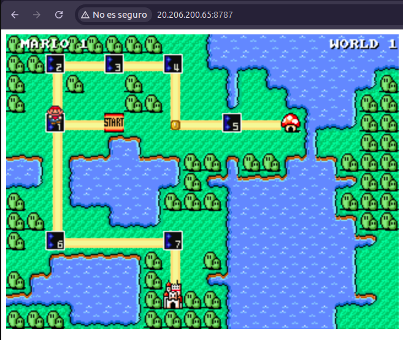

# **Instalación de Ansible y Configuración de VM con Terraform para Ejecutar Mario Bros**

## **1️⃣ Instalación de Ansible en Ubuntu**

Para gestionar mi infraestructura con Ansible, primero instalé Ansible en mi máquina Ubuntu siguiendo estos pasos:

```bash
sudo apt update
sudo apt install software-properties-common
sudo add-apt-repository --yes --update ppa:ansible/ansible
sudo apt install ansible

```

Para verificar que la instalación fue exitosa, ejecuté:

```bash
ansible --version
```

Si todo está correcto, debería mostrar algo como:

```
ansible [core 2.17.9]
```

---

## **2️⃣ Creación de la Máquina Virtual en Azure con Terraform**

Para desplegar mi máquina virtual en Azure, usé Terraform y el repositorio [VirtualMachineTerraform](https://github.com/Ricardo965/VirtualMachineTerraform).

### **📌 Pasos para desplegar la VM**

1. **Clonar el repositorio**

```bash
git clone https://github.com/Ricardo965/VirtualMachineTerraform.git
cd VirtualMachineTerraform
```

1. **Configurar las credenciales de Azure**

   Es necesario autenticarme en Azure antes de ejecutar Terraform:

   ```bash
   az login
   ```

2. **Inicializar Terraform**

   ```bash
   terraform init

   ```

3. **Planear la infraestructura (Teniendo en cuenta el secrets.tfvars que debia crear para poder correrla)**

   ```bash
   terraform plan -var-file=secrets.tfvars

   ```

4. **Aplicar la configuración y crear la VM. (Teniendo en cuenta el secrets.tfvars) que debia crear para poder correrla)**

   ```bash
   terraform apply -var-file=secrets.tfvars -auto-approve

   ```

   Una vez finalizado, Terraform mostrará la **IP pública** de la máquina virtual, que usaré más adelante.

---

## **3️⃣ Configuración de Ansible para la VM**

Ahora que mi VM está lista, la configuro para instalar Docker y ejecutar el contenedor de **Super Mario Bros**.

### **📌 Configurar el archivo de hosts de Ansible**

En el archivo `inventory/hosts.ini`, agrego la IP de mi VM, teniendo en cuenta la password y user que usé para crear la VM en `secrets.tfvars` del anterior proyecto:

```
[azure_vm]
<IP_DE_LA_VM> ansible_user=azureadmin ansible_ssh_pass=Ricardo101196

```

Reemplazo `<IP_DE_LA_VM>` con la IP pública que Terraform me proporcionó.

### **📌 Verificar la conexión con la VM**

```bash
ansible -i inventory/hosts.ini azure_vm -m ping

```

Si responde `pong`, significa que la conexión es exitosa. ✅

---

## **4️⃣ Ejecutar los Playbooks de Ansible**

Para instalar Docker en la VM, corro:

```bash
ansible-playbook -i inventory/hosts.ini playbooks/install_docker.yml

```

Luego, para ejecutar el contenedor de **Mario Bros**, ejecuto:

```bash
ansible-playbook -i inventory/hosts.ini playbooks/run_container.yml

```

---

Hago un `ssh` a la maquina y ejecuto un `sudo docker ps` para verificar que el contenedor está arriba. Cuando me percato que está arriba, realizo un:

```bash
sudo ufw allow 8787
sudo ufw reload
```

Esto para permitir que la VM reciba trafico por dicho puerto y acceder al juego de manera remota.

## **5️⃣ Jugar Mario Bros en la VM** 🎮

Una vez que el contenedor está corriendo, puedo acceder al juego desde mi navegador en:

```
http://<IP_DE_LA_VM>:8787
```

---

## **6️⃣ Comprobaciones y Solución de Problemas**

- **Verificar que el contenedor está corriendo:**
  ```bash
  docker ps
  ```
  Puedo revisar los logs con:
  ```bash
  docker logs -f supermario-container
  ```
- **Abrir el puerto en el firewall (si es necesario):**
  ```bash
  sudo ufw allow 8787
  sudo ufw reload
  ```

---

## **7️⃣ Limpieza y Eliminación de Recursos**

Si ya no necesito la VM y quiero eliminar todo el entorno, ejecuto:

```bash
terraform destroy -auto-approve
```

---

## **🎮 ¡Listo! Ahora puedo jugar Mario Bros en mi propia VM en Azure. 🚀**

Ejemplo de cómo se ve el juego en acción:


